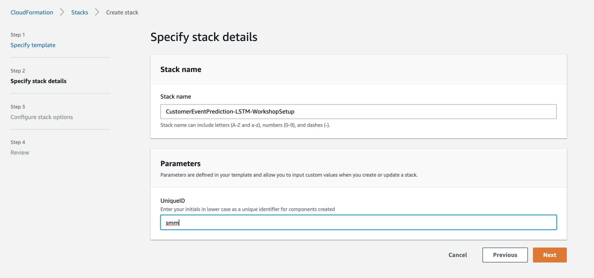

This workshop showcases using LSTM on Amazon SageMaker for predicting customer's future events based on the events customers participate in. 

TODO : Add a paragraph about LSTM

This example is based on the session "A novel adoption of LSTM in customer touchpoint prediction" from Strata 2018 conference proceedings.
(https://conferences.oreilly.com/artificial-intelligence/ai-ca-2018/public/schedule/detail/68831)
TODO : Add a paragraph to explain the use case.

### Prerequisites

To run this workshop, you will need 
* An AWS Account 
* IAM user with access to the AWS services : S3, SageMaker, CloudFormation 

### High Level Steps

High level steps to run the workshop :

1. Setup : Execute a cloudformation template that creates a Amazon SageMaker notebook with this git repo downloaded.
2. Build, train and deploy LSTM model : Open the Jupyter notebook created in step 1 and execute notebook cells to examine data, train/deploy the LSTM model and make predictions.

#### Step 1 - Setup

In this step, you will execute a Cloud Formation template to do some initial setup of our environment including creating:

* SageMaker Notebook Instance: This notebook instance will be used as our lab environment after our initial setups required for setting up the workshop.

* SageMaker Notebook lifecycle configuration: Lifecycle configuration created to automatically clone this workshop repository including the notebook instance included for this workshop.

##### Detailed Steps

1. Download this git repository by either cloning the repository or downloading the *zip

2. Login to the [AWS Console](https://https://console.aws.amazon.com/) and enter your credentials

3. Under **Services**, select search for and select [CloudFormation](https://console.aws.amazon.com/cloudformation)

4. Click **Create Stack** buttton

   
   
5. Under **Select Template**:
    * Click radio button next to 'Upload a template to Amazon S3', then click **Browse...**

    * From the local repository cloned to your machine in the detailed step 1, select the file ./prep/Workshop-Prep.yml

    * Click **Open**
    
    
    
6. Under **Specify Stack Details**, enter: 

   * **Stack Name**: LSTM-WorkshopSetup 

   *  **UniqueID**: Enter *yourinitials* in lower case (Example: jdd)

   

7. Click **Next**

8. Under **Options**, leave all defaults and click '**Next**'

9. Under **Review**, scroll to the bottom and check the checkbox acknowledging that CloudFormation might create IAM resources and custom names, then click **Create**

10. You will be returned to the CloudFormation console and will see your stack status '**CREATE_IN_PROGRESS**'

11. After a few minutes, you will see your stack Status change to '**CREATE_COMPLETE**'.  You're encouraged to go explore the resources created as part of this initial setup. 

#### Step 2 - Build, train and deploy LSTM Model

To train, deploy the LSTM model and make predictions execute open the notebook and execute each cell.

